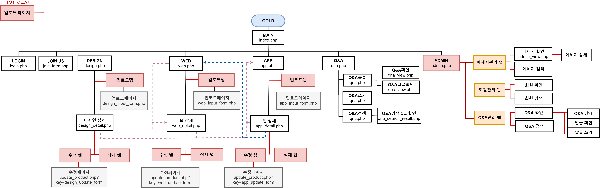

# DB Project(2020.12~2021.02)

데이터베이스를 활용해 제작한 사이트입니다.

# 1. 주요화면

---

# 2. 사이트 요약

**#로그인 #회원가입 #QNA게시판  #자료업로드**

**#관리자기능 #회원관리 #메세지관리 #QNA관리 #등록 #수정 #삭제 #검색** 

▪️제작기간 : 2개월

---

# 3. 사이트 전체  구조

- 사이트의 UI 구조입니다. 각 페이지 간 이동을 점선으로 표시했고, LV.1으로 로그인할 경우 접근 가능한 페이지는 별도로 표시했습니다.

---

# 4. 사용 언어

### ✔️ HTML5

### ✔️CSS3

### ✔️ Javascript

### ✔️ PHP

### ✔️ Maria DB

---

# 5. 사용 프레임워크 및 플러그인

jQuery

light slider

---
